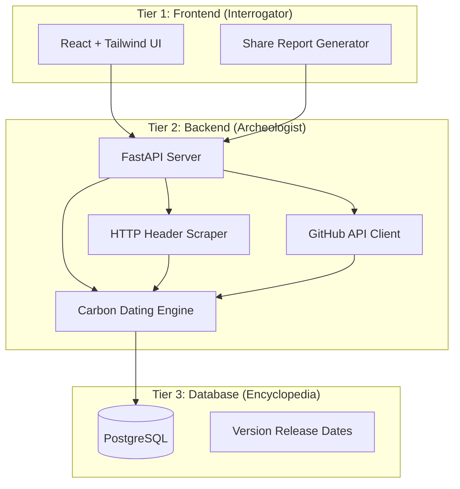

# Design Document: StackDebt

## Overview

StackDebt is a web application that performs "Carbon Dating" on software infrastructure by analyzing version numbers to calculate the "Effective Age" of technology stacks. The system uses a three-tier architecture with a React frontend, FastAPI backend, and PostgreSQL database to provide engaging technical debt analysis.

The core innovation is the "Weakest Link" algorithm that weights critical infrastructure components (OS, languages, databases) more heavily than libraries, providing a realistic assessment of infrastructure risk rather than simple averaging.

## Architecture

### High-Level Architecture



### Technology Stack

- **Frontend**: React 18+ with TypeScript, Tailwind CSS for styling
- **Backend**: Python FastAPI with async/await for performance
- **Database**: PostgreSQL 14+ with proper indexing for version lookups
- **External APIs**: GitHub REST API v4, HTTP requests library (httpx)
- **Deployment**: Docker containers for consistent deployment

## Components and Interfaces

### Frontend Components (Interrogator)

#### InputInterface Component
```typescript
interface InputInterfaceProps {
  onSubmit: (url: string) => Promise<void>;
  isLoading: boolean;
}

interface AnalysisRequest {
  url: string;
  type: 'website' | 'github';
}
```

**Responsibilities:**
- URL validation and type detection (website vs GitHub)
- Dark mode UI with terminal-style aesthetics
- Loading animations during analysis
- Error display for invalid inputs

#### ResultsDisplay Component
```typescript
interface AnalysisResult {
  stackAge: number;
  components: Component[];
  riskSummary: RiskSummary;
  roastCommentary: string;
}

interface Component {
  name: string;
  version: string;
  releaseDate: Date;
  category: ComponentCategory;
  riskLevel: RiskLevel;
  weight: number;
}
```

**Responsibilities:**
- Display calculated Stack Age prominently
- Show component timeline with visual risk indicators
- Render engaging "roast" commentary
- Organize components by category (OS, Languages, Libraries)

#### ShareReport Component
```typescript
interface ShareCardConfig {
  stackAge: number;
  topRisks: Component[];
  branding: BrandingConfig;
  format: 'twitter' | 'linkedin' | 'slack';
}
```

**Responsibilities:**
- Generate social media optimized image cards
- Include key metrics and visual branding
- Support multiple platform formats
- Enable download as PNG/JPG

### Backend Services (Archeologist)

#### HTTPHeaderScraper Service
```python
class HTTPHeaderScraper:
    async def analyze_website(self, url: str) -> List[Component]:
        """Scrape HTTP headers to detect web server and frontend technologies."""
        pass
    
    def _parse_server_header(self, headers: Dict[str, str]) -> Optional[Component]:
        """Extract server information from Server header."""
        pass
    
    def _detect_technologies(self, headers: Dict[str, str]) -> List[Component]:
        """Detect additional technologies from various headers."""
        pass
```

**Detection Methods:**
- Server header parsing (Apache/2.4.41, nginx/1.18.0)
- X-Powered-By header analysis (PHP/7.4.3, Express)
- Content-Type and other headers for framework detection
- Response timing and behavior analysis for fingerprinting

#### GitHubAnalyzer Service
```python
class GitHubAnalyzer:
    async def analyze_repository(self, repo_url: str) -> List[Component]:
        """Analyze GitHub repository for dependencies and infrastructure."""
        pass
    
    async def _parse_package_files(self, repo_data: RepoData) -> List[Component]:
        """Parse package.json, requirements.txt, go.mod, etc."""
        pass
    
    async def _parse_dockerfiles(self, repo_data: RepoData) -> List[Component]:
        """Extract base images and installed packages from Dockerfiles."""
        pass
```

**File Parsing Support:**
- **JavaScript/Node.js**: package.json, package-lock.json
- **Python**: requirements.txt, pyproject.toml, setup.py
- **Go**: go.mod, go.sum
- **Java**: pom.xml, build.gradle
- **Docker**: Dockerfile, docker-compose.yml
- **Infrastructure**: terraform files, kubernetes manifests

#### CarbonDatingEngine Service
```python
class CarbonDatingEngine:
    def calculate_stack_age(self, components: List[Component]) -> StackAgeResult:
        """Calculate weighted effective age using Weakest Link theory."""
        pass
    
    def _apply_component_weights(self, components: List[Component]) -> List[WeightedComponent]:
        """Apply category-based weights to components."""
        pass
    
    def _calculate_risk_levels(self, components: List[Component]) -> List[Component]:
        """Assign risk levels based on age and EOL status."""
        pass
```

**Weighting Algorithm:**
- **Critical Components (Weight: 0.7)**: OS, Programming Languages, Databases
- **Important Components (Weight: 0.3)**: Web Servers, Major Frameworks
- **Minor Components (Weight: 0.1)**: Libraries, Development Tools

**Age Calculation Formula:**
```
Effective_Age = Σ(Component_Age × Component_Weight × Risk_Multiplier) / Σ(Component_Weight)

Risk_Multiplier:
- Critical Risk (EOL or >5 years): 2.0
- Warning (2-5 years): 1.5  
- OK (<2 years): 1.0
```

### Database Schema (Encyclopedia)

#### Version Releases Table
```sql
CREATE TABLE version_releases (
    id SERIAL PRIMARY KEY,
    software_name VARCHAR(255) NOT NULL,
    version VARCHAR(100) NOT NULL,
    release_date DATE NOT NULL,
    end_of_life_date DATE,
    category component_category NOT NULL,
    is_lts BOOLEAN DEFAULT FALSE,
    created_at TIMESTAMP DEFAULT NOW(),
    UNIQUE(software_name, version)
);

CREATE INDEX idx_software_version ON version_releases(software_name, version);
CREATE INDEX idx_release_date ON version_releases(release_date);
```

#### Component Categories Enum
```sql
CREATE TYPE component_category AS ENUM (
    'operating_system',
    'programming_language', 
    'database',
    'web_server',
    'framework',
    'library',
    'development_tool'
);
```

**Data Sources for Population:**
- Official release pages and changelogs
- Package registry APIs (npm, PyPI, Maven Central)
- Operating system release schedules
- Database vendor documentation
- Framework and library GitHub releases

## Data Models

### Core Domain Models

```python
from enum import Enum
from datetime import date, datetime
from pydantic import BaseModel
from typing import List, Optional

class ComponentCategory(str, Enum):
    OPERATING_SYSTEM = "operating_system"
    PROGRAMMING_LANGUAGE = "programming_language"
    DATABASE = "database"
    WEB_SERVER = "web_server"
    FRAMEWORK = "framework"
    LIBRARY = "library"
    DEVELOPMENT_TOOL = "development_tool"

class RiskLevel(str, Enum):
    CRITICAL = "critical"
    WARNING = "warning"
    OK = "ok"

class Component(BaseModel):
    name: str
    version: str
    release_date: date
    end_of_life_date: Optional[date]
    category: ComponentCategory
    risk_level: RiskLevel
    age_years: float
    weight: float

class StackAgeResult(BaseModel):
    effective_age: float
    total_components: int
    risk_distribution: Dict[RiskLevel, int]
    oldest_critical_component: Optional[Component]
    roast_commentary: str

class AnalysisRequest(BaseModel):
    url: str
    analysis_type: str  # 'website' or 'github'

class AnalysisResponse(BaseModel):
    stack_age_result: StackAgeResult
    components: List[Component]
    analysis_metadata: Dict[str, Any]
    generated_at: datetime
```

### API Endpoints

```python
# FastAPI endpoint definitions
@app.post("/api/analyze", response_model=AnalysisResponse)
async def analyze_infrastructure(request: AnalysisRequest):
    """Main analysis endpoint for both websites and GitHub repos."""
    pass

@app.get("/api/components/{software_name}/versions")
async def get_software_versions(software_name: str):
    """Get available versions for a specific software."""
    pass

@app.post("/api/share/generate")
async def generate_share_card(result: StackAgeResult, config: ShareCardConfig):
    """Generate social media share cards."""
    pass
```

## Correctness Properties

*A property is a characteristic or behavior that should hold true across all valid executions of a system—essentially, a formal statement about what the system should do. Properties serve as the bridge between human-readable specifications and machine-verifiable correctness guarantees.*

### Property 1: URL Input Validation
*For any* string input, the system should accept it as valid if and only if it matches either a valid website URL format or a valid GitHub repository URL format
**Validates: Requirements 1.1, 1.3**

### Property 2: Analysis Initiation
*For any* valid URL input, submitting it should trigger the carbon dating analysis process and display loading indicators
**Validates: Requirements 1.2, 1.5**

### Property 3: Website Analysis Scope
*For any* website URL analysis, all detected components should be publicly visible technologies (web servers, CDNs, frontend frameworks) and not include backend-only components
**Validates: Requirements 2.1, 2.2**

### Property 4: GitHub Analysis Completeness
*For any* GitHub repository analysis, the system should detect components from all supported file types (package files, Dockerfiles, config files) present in the repository
**Validates: Requirements 2.3, 2.4, 2.5**

### Property 5: Analysis Resilience
*For any* analysis where some component detection fails, the system should continue processing with available data and log failures without crashing
**Validates: Requirements 2.6**

### Property 6: Version Database Integration
*For any* detected component, if its version exists in the Encyclopedia database, the system should retrieve and use the correct release date for age calculation
**Validates: Requirements 2.7**

### Property 7: Component Weighting System
*For any* set of detected components, critical components (OS, languages, databases) should receive higher weights than non-critical components (libraries, tools)
**Validates: Requirements 3.1, 3.2**

### Property 8: Weakest Link Algorithm
*For any* component set with mixed ages, the calculated effective age should be influenced more heavily by older critical components than by newer non-critical components
**Validates: Requirements 3.3, 3.4**

### Property 9: Age Calculation Precision
*For any* calculated stack age, the output should be formatted as a decimal number with exactly one decimal place
**Validates: Requirements 3.5**

### Property 10: Risk Classification System
*For any* component with a known release date, its risk level should be Critical if >5 years old or past EOL, Warning if 2-5 years old, and OK if <2 years old
**Validates: Requirements 4.1, 4.2, 4.3**

### Property 11: Risk Classification Explanation
*For any* component with an assigned risk level, the system should provide contextual information explaining why that classification was assigned
**Validates: Requirements 4.5**

### Property 12: Results Display Completeness
*For any* analysis result, the displayed output should include the stack age, all detected components with their details (name, version, release date, risk level), and roast commentary
**Validates: Requirements 5.1, 5.2, 5.3, 5.4**

### Property 13: Component Organization
*For any* set of displayed components, they should be grouped and organized by their category (OS, Languages, Databases, Libraries)
**Validates: Requirements 5.5**

### Property 14: Share Card Generation
*For any* analysis result, the share feature should generate image cards containing the stack age, key risk components, branding, and be optimized for social media platform dimensions
**Validates: Requirements 6.1, 6.2, 6.3**

### Property 15: Share Functionality Access
*For any* user, the share and download features should work without requiring authentication or account creation
**Validates: Requirements 6.4, 6.5**

### Property 16: Encyclopedia Completeness
*For any* major software category (OS, languages, databases, frameworks), the Encyclopedia database should contain release date information for commonly used versions
**Validates: Requirements 7.1, 7.2, 7.3, 7.4**

### Property 17: Missing Version Handling
*For any* component version not found in the Encyclopedia, the system should log the missing data and exclude it from age calculations without failing
**Validates: Requirements 7.5**

### Property 18: Database Update Capability
*For any* new software release data, the Encyclopedia should support adding it to the database for future analyses
**Validates: Requirements 7.6**

### Property 19: Performance Requirements
*For any* website analysis, it should complete within 10 seconds, and for any GitHub repository under 100MB, analysis should complete within 30 seconds
**Validates: Requirements 8.1, 8.2**

### Property 20: Concurrent Request Handling
*For any* set of simultaneous analysis requests, the system should process them concurrently without interference or data corruption
**Validates: Requirements 8.3**

### Property 21: External Service Failure Handling
*For any* external service failure (GitHub API unavailable), the system should return appropriate error messages rather than crashing
**Validates: Requirements 8.4**

### Property 22: Rate Limiting
*For any* sequence of requests exceeding the rate limit, the system should throttle requests while maintaining good user experience for normal usage
**Validates: Requirements 8.5**

### Property 23: Error Logging and User Messages
*For any* error condition, the system should log detailed error information for debugging while displaying user-friendly messages to the user
**Validates: Requirements 9.4**

### Property 24: Partial Success Handling
*For any* analysis that partially succeeds, the system should display available results with clear warnings about incomplete data
**Validates: Requirements 9.5**

## Error Handling

### Error Categories and Responses

**Input Validation Errors:**
- Invalid URL formats → Clear validation messages with examples
- Unsupported repository types → Guidance on supported formats
- Malformed requests → Structured error responses with correction hints

**External Service Errors:**
- GitHub API rate limiting → Retry with exponential backoff
- Network timeouts → Graceful degradation with partial results
- Authentication failures → Clear instructions for public repository access

**Analysis Errors:**
- No components detected → Helpful troubleshooting suggestions
- Partial component detection → Results with warnings about missing data
- Database lookup failures → Graceful handling with logging

**System Errors:**
- Database connectivity issues → Service unavailable messages with retry suggestions
- Memory/resource constraints → Request queuing with user feedback
- Unexpected exceptions → Generic error messages with incident tracking

### Error Recovery Strategies

```python
class ErrorRecoveryStrategy:
    async def handle_github_api_failure(self, error: GitHubAPIError) -> AnalysisResult:
        """Attempt alternative analysis methods when GitHub API fails."""
        if error.is_rate_limited():
            return await self.queue_for_retry(error.retry_after)
        elif error.is_repository_private():
            return self.create_access_error_response()
        else:
            return self.create_partial_analysis_from_cache()
    
    async def handle_partial_component_detection(self, 
                                               detected: List[Component], 
                                               failed: List[str]) -> AnalysisResult:
        """Provide meaningful results even when some detection fails."""
        result = await self.calculate_age_from_available_components(detected)
        result.warnings = self.generate_missing_component_warnings(failed)
        return result
```

## Testing Strategy

### Dual Testing Approach

The testing strategy employs both unit tests and property-based tests to ensure comprehensive coverage:

**Unit Tests** focus on:
- Specific examples of component detection and parsing
- Edge cases like empty repositories or malformed files
- Integration points between services
- Error conditions and recovery scenarios
- Performance benchmarks for critical paths

**Property-Based Tests** focus on:
- Universal properties that hold across all inputs
- Comprehensive input coverage through randomization
- Correctness properties derived from requirements
- System behavior under various data combinations

### Property-Based Testing Configuration

**Testing Framework:** Hypothesis (Python) for backend services, fast-check (TypeScript) for frontend components

**Test Configuration:**
- Minimum 100 iterations per property test
- Each property test references its design document property
- Tag format: **Feature: stackdebt, Property {number}: {property_text}**

**Example Property Test Structure:**
```python
from hypothesis import given, strategies as st
import pytest

@given(st.lists(st.builds(Component, 
                         category=st.sampled_from(ComponentCategory),
                         age_years=st.floats(min_value=0, max_value=20))))
def test_property_7_component_weighting_system(components):
    """Feature: stackdebt, Property 7: Component weighting system"""
    result = carbon_dating_engine.calculate_weights(components)
    
    critical_components = [c for c in components if c.category in CRITICAL_CATEGORIES]
    non_critical_components = [c for c in components if c.category not in CRITICAL_CATEGORIES]
    
    if critical_components and non_critical_components:
        max_critical_weight = max(result.weights[c.id] for c in critical_components)
        max_non_critical_weight = max(result.weights[c.id] for c in non_critical_components)
        assert max_critical_weight > max_non_critical_weight
```

### Unit Testing Balance

Unit tests complement property tests by focusing on:
- **Specific Examples**: Known good/bad inputs with expected outputs
- **Integration Testing**: API endpoint behavior and database interactions  
- **Edge Cases**: Empty inputs, malformed data, boundary conditions
- **Performance Testing**: Response time validation for critical operations

Property tests handle comprehensive input coverage, while unit tests ensure specific scenarios work correctly and provide regression protection for known issues.

### Test Data Management

**Mock Data Strategy:**
- Comprehensive test database with known software versions
- Mock HTTP responses for various server types and configurations
- Sample GitHub repositories with different technology stacks
- Generated test cases covering edge conditions

**Test Environment:**
- Isolated test database with controlled version data
- Mock external services (GitHub API, HTTP endpoints)
- Containerized test environment for consistency
- Automated test data refresh and cleanup